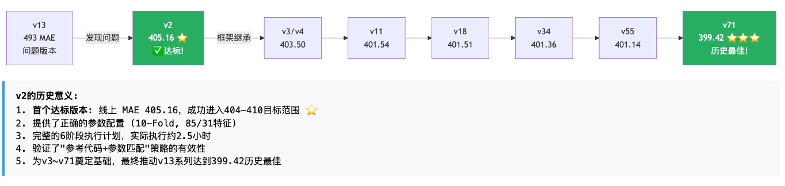
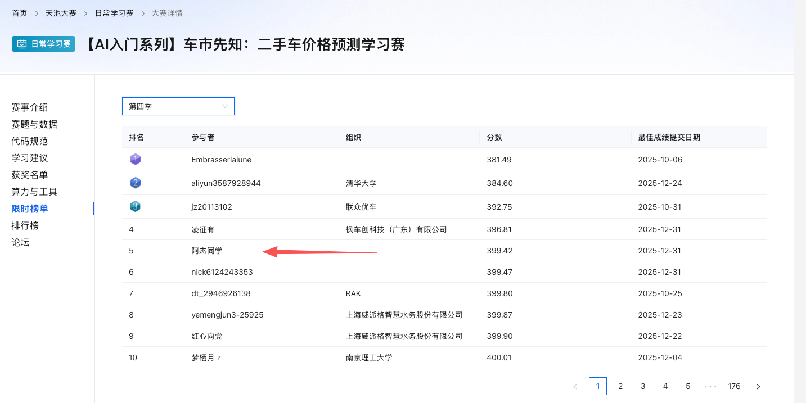
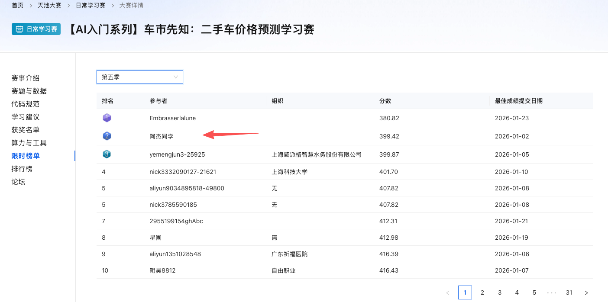
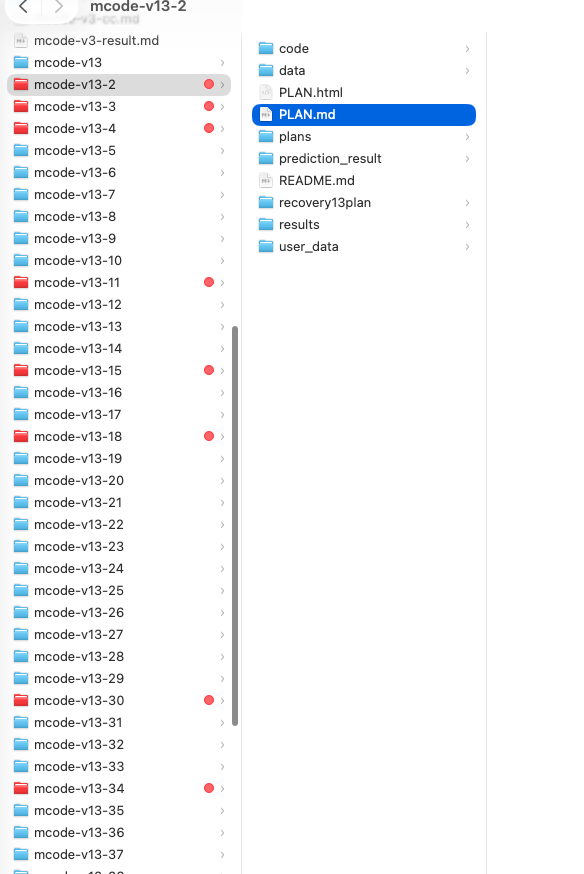
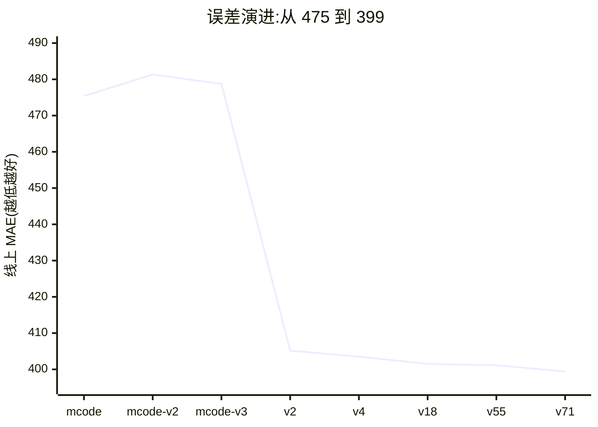
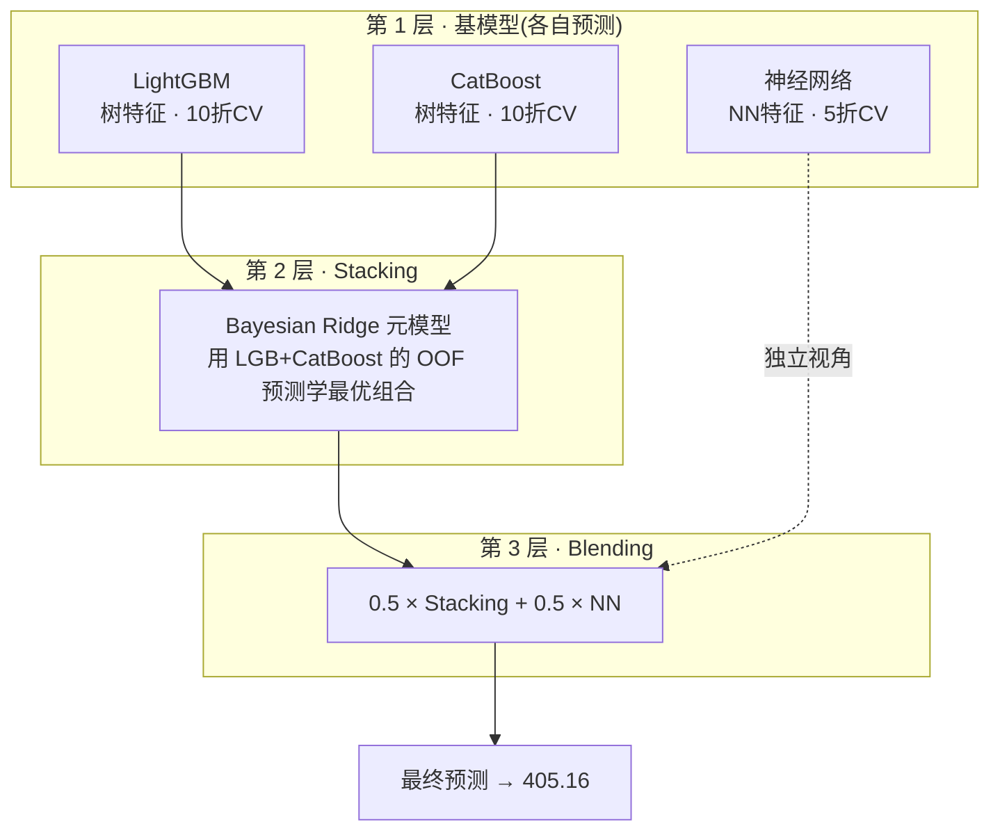

# AI-二手车价格预测误差399元-阿里天池Top5方案

> —— 一次 AI 应用的极限工程复盘 · 阿里天池 Top5

**如何使用AI 达到顶尖水平**


**一句话战绩**:71 个版本、100 条踩坑定律,把 5 万辆车的平均预测误差从 475 元一路逼近到 **399.42 元**,第四赛季进入 Top5,第五赛季冲到 Top2。

| 最终误差 | 迭代版本 | 沉淀定律 | 赛季名次 |
|:---:|:---:|:---:|:---:|
| **399.42 元** | 71 个 | 100 条 | S4 Top5 · S5 Top2 |

> 作者:一名 AI 应用工程师。全文约 1.2 万字,建议收藏细读。
>
> 

**演进路线:**








# 定目标，选AI，定架构，如何迭代？

**我的原则是：是大力出奇迹，高投入、高产出。**

所有代码、所有方向**都是由AI产出**，人只需要做决策、定架构、定方向。


## **1.定目标选AI：**

如果你的目标就是取得一个顶尖的成绩，那么必定要选择顶尖的AI， 

Cloud code, codex 作为编码工具。GPT Gemini 作为搜索和制定方案的工具。 

因为关键最后决定胜负的可能就是那么一两分或者零点几分。

如果是简单跑一下流程，基本的会用，那么豆包、千问或者其他的都可以。放在这个项目上，差距会非常大。

## **2.定架构：**

好的架构决定了迭代的效率，和迭代的可靠性。

a.每个版本有一个plan ，先详细规划这个plan，

把计划和预期的结果设定好边界。如果是计划与预期的结果或者向着好的方向前进，那么继续，否则调整方案。

b.在复盘每一个plan 把所有的版本汇总到一个统一的 summary 文档里面里边。 

## **3.迭代:**

因为好的结果肯定是一步步迭代而来的，而不是说第一步就能拿到一个好的结果。

a.总的迭代文件和方向是在这个summary文档中汇总

b.文件代码的管理形式，使用文件夹形式进行迭代，好的模型、好的测试方法，可以后面迭代方法进行融合

​	因为每一个版本的训练的模型和结果需要保存，后续，调参、融合需要。这里采用的是文件夹的形式进行迭代，不使用 git 在一个版本上进行持续迭代

c.总结规律，汇总演进的方向，防止漏项，禁止错误重犯




## **4.plan制定的方法:**

使用GPT Gemini 进行全网搜索交叉验证。

举例1.使用GPT搜索出来一个迭代的方向，再使用gemini进行评判这个方向，最后把这个方案交给Codex和Claude Code去进行评判和实施。

当没有方向的时候，那就多挑几个没有尝试过的方向进行试错。


**下面具体讲一下是怎么做到的：  **

1. **科普**:AI 到底怎么给一辆车定价?
2. **技术**:三层融合架构 + 双路特征工程,一次砍掉 72 分误差的关键跃迁
3. **复盘**:25 个被亲手证伪的"死胡同",和它们背后的 100 条定律
4. **方法论**:普通人和高手做 AI 项目,差在哪一步?

> 📦 **代码开源**:基线(v2)与后续演进方案已整理开源,GitHub 仓库地址见文末。


## :这更是一次「人 + 多 AI 协作」的工程实践

需要先说明的是,这 71 个版本全部是由AI做的。是一套 **「人定方向 + 多个大模型交叉验证」** 的协作流程:

- **人负责决策演进方向**:定义每一轮要验证的假设、设定止损线、判断一个实验该进主线还是该被砍掉;
- **多个 AI(GPT / Gemini / Claude Code / Codex)负责放大执行**:分别给出方案、互相交叉验证、快速产出可运行的实验代码;
- **在冲突处做裁决**:当不同 AI 给出的建议不一致时,用 OOF （本地验证预测）和线上结果做最终仲裁,而不是听谁说得漂亮。

真正稀缺的能力不是「会调用哪个模型」,而是 **在人与多个 AI 之间,搭起一套能持续逼近最优解、并快速迭代演进的工程闭环**。

**这套闭环和迭代思维,才是本文最想分享的东西。**


# 1 · 科普:AI 怎么给一辆二手车定价?

想象你要卖一辆开了 5 年的车。你会看品牌、看公里数、看车况、看上牌年份……然后心里有个数。**机器学习做的事情本质一样,只是它能同时盯着几十个维度,并从 15 万条历史成交记录里,学出这些维度和成交价之间的隐藏规律。**

**阿里天池"二手车价格预测"赛题**,数据是脱敏后的真实交易:

- **数据规模**:训练集 `150,000` 条(带成交价)+ 测试集 `50,000` 条(要预测),合计 **20 万辆车**。
- **每辆车的信息**:品牌 / 车型 / 车身类型 / 燃油类型 / 变速箱 / 公里数 / 功率 / 上牌与发布日期 / 是否有未修复损坏,外加 **15 个脱敏匿名特征 v_0~v_14**。


# 先确定的是一套实验闭环：

```
建立基线
    ↓
发现当前瓶颈
    ↓
提出一个可验证的假设
    ↓
通过 OOF(本地验证预测) 和线上结果验证
    ↓
有效方案进入主线
    ↓
失败方案记录原因（避免重复犯错）
    ↓
进入下一轮实验
```

回头看，这 71 个版本大致可以归纳成五个阶段：

1. **跑通基线**：使用 CatBoost 单模型，得到 475.38；

    CatBoost：一种梯度提升树(GBDT)算法,由 Yandex
     开发。最大特点是能原生处理类别特征(如品牌、车型),不需要手动做独热编码,对缺失值也很鲁棒。

2. **重建架构**：建立 Tree + NN 双路方案，快速下降到 405.16；

   Tree (决策树) NN（Neural Network，神经网络）

3. **资产化与融合**：固化 OOF 、模型池和融合流水线，下降到约 401.5；

4. **广泛试错与精调**：测试特征、Stacking、残差和后处理等方案，把人工方案推到 401.13；

5. **异质模型突破**：扩大 AutoGluon (自动机器学习AutoML) 的融合权重，最终达到 399.42。

目的: 先建立可信的验证体系OOF，把成功方案沉淀成模块 （模型池），把失败方案沉淀成边界，形成一套可以持续迭代的 AI 工程系统。


### 整体技术架构：

```
原始数据
   ↓
数据清洗
   ↓
特征工程（基础特征 + 交叉特征）
   ↓
模型训练（划分训练集和验证集，选择模型，设置超参数）
   ↓
交叉验证与误差分析
   ↓
模型融合
   ↓
后处理
   ↓
生成最终价格
```


### 迭代结果: 5 阶段

1. 搭基线（单模型 475）
2. 大提分（模型融合 401.5）
3. 排坑（测试各类高阶技术，全部无效）
4. 精调（权重 / 后处理，摸到天花板 401.1）
5. 终突破（AutoGluon 融合 → 399.42）

## 评判标准:MAE,越小越好

比赛用 **MAE(平均绝对误差)** 打分,很直白:

```
MAE = ( |预测价₁ − 真实价₁| + |预测价₂ − 真实价₂| + … ) / 50000
```

所以 **MAE = 399.42 的含义是:对 5 万辆车,平均每辆只猜偏了约 399 元。** 这些车价格从几千到十万元不等。

> 💡 在这个赛题里,500 是公认的心理关口。多数公开方案卡在 405~420。
>
> 把误差压进 400 以内,意味着进入 Top5。——这正是本文主线。

## 全文核心一张图:误差演进曲线



**读图要点**:左边三个点(单模型)长期卡在 475+;**v2 一次跳到 405** 是质变;此后 60 多个版本只是在 405→399 的 6 分窄缝里精雕细琢。

---


# 2 · 技术:一次砍掉 73 分误差的架构

先用单模型拿到比较好的结果。然后再进行模型融合。


mcode 第一阶段:直接上强模型 CatBoost,调参拿到 **475 分**。然后加 Stacking、做多阶段实验——**结果不升反降到 481、478**。第一个信号:*单模型的极限差不多了，盲目堆技巧,会让模型更差。*

| 阶段 | 线上 MAE | 核心方法 | 结果 |
|---|---|---|---|
| mcode | 475.38 | CatBoost 单模型 | 朴素基线 |
| mcode-v2 | 481.31 | Stacking 尝试 | ↑ 退步 |
| mcode-v3 | 478.75 | 多阶段实验 | ↑ 退步 |
| **v2** | **405.16** | 双路特征 + 三层融合 | **↓ 一次跳 73 分** |

真正的突破来自一次"推倒重做":严格一套经过验证的**三层堆叠融合**架构,直接从 475 干到 405。精髓有两点。

## ① 双路特征工程:同一份数据,两套"食材"

最容易被忽视却最致命的一步。**树模型(LightGBM / CatBoost)和神经网络,对"好特征"的定义完全不同**,必须分两条流水线:

**🌲 树模型路线(83 个特征)**——树模型不怕高基数类别、不怕缺失值,擅长吃统计聚合:
- 保留 brand / model 等高基数类别
- `groupby('brand')['power']` 的均值/标准差
- v 特征之间的加法、乘法交叉
- 计数编码、车龄等时间特征

**🧠 神经网络路线(29 个特征)**——NN 怕量纲、怕缺失、怕长尾,必须先洗干净:
- MinMax / 标准化归一到统一量纲
- 对长尾价格做 `log1p` 对数变换
- 缺失值用中位数/众数填充(NN 吃不了 NaN)
- 类别先 LabelEncoder 再归一化

> 📐 **定律 · 加信息 ≫ 删数据**
> 贡献最大的一步就是"双路特征"——一次性带来约 **72 分**改进(475→403)。相比之下,后期所有"删脏数据"的尝试加起来天花板只有 **~4 分**。**给模型补充它看不到的新信息,远比清洗已有数据更有价值。**

## ② 三层堆叠:让模型互相投票,再请一个裁判

单个模型再强也有偏见。三层架构:**先让多个不同模型各自预测,再训练一个"元模型"学习如何最优组合它们。**



**架构精髓**:第 1 层多模型并行(树模型走 Stacking 汇聚,NN 单独保留);第 3 层让"集体智慧"和"独立视角"各占一半。NN 单独抽出来,是因为它的特征处理方式与树模型差异最大,能提供最宝贵的**多样性**。

## 两个工程师必须懂的概念

### 概念一:OOF(Out-Of-Fold)—— 防止自欺欺人的标尺

做 Stacking 有个致命陷阱:用"模型见过的数据"的预测去训练上层,等于让学生拿着答案考试,分数虚高、一上线就崩。**OOF 的做法是:每个样本的预测,只能来自"没在训练中见过它"的那一折模型。**

```
# 5折交叉验证的 OOF 示意
第1折: 用 [C,D,E,F] 训练 → 预测 [A,B]   # A、B 是"没见过的"
第2折: 用 [A,B,E,F] 训练 → 预测 [C,D]
...
OOF 预测 = 拼接所有折的"陌生预测"
# OOF MAE 才是对线上表现的诚实估计
```

> ⚠️ **反向用法:OOF 还是"作弊探测器"**
> 项目中有个版本 OOF MAE 突然低到 101(正常 400+)。这种"好得不真实"的数字,几乎一定是**数据泄漏**——某个特征偷偷包含了答案。后来证实它用了 `price / brand_mean_price` 这类把目标价塞进分子的比值特征。**异常漂亮的指标,先怀疑,别庆祝。**

### 概念二:融合的"质量相近"铁律

很多人以为模型越多、融合越猛越好。恰恰相反:

```
if |MAE_A − MAE_B| > 50:   # 两模型差距过大
    ❌❌ 绝对禁止融合 —— 差模型会"污染"好模型
if |MAE_A − MAE_B| < 5:
    ⚠️ 可以尝试,但必须先在 OOF 上验证
```

有一次把 417 分的模型和 401 分的模型融合,期待"多样性收益",结果**融合后比两个模型单独都差**(424)。低质量模型的错误方向,会把高质量模型一起带偏。

## 临门一脚:AutoGluon 带来"真多样性"

主线优化到 401.14 后卡了几十个版本。突破 400 的最后一脚是引入 **AutoGluon**(自动机器学习),它自动训练并堆叠了 RF、ExtraTrees、CatBoost、LGB 等一批模型。单独用它只有 428 分,但它的"错误方向"和主线不同:

| 融合比例 | 线上 MAE | 说明 |
|---|---|---|
| 纯 AutoGluon | 428.90 | 单独很差 |
| AG 50% + 主线 50% | 400.26 | 接近 |
| AG 45% + 主线 55% | 399.92 | 首次破 400! |
| **AG 30% + 主线 70%** | **399.42** | ★ 历史最佳 |

> 📐 **定律 · 多样性 > 同质数量 > 后处理调参**
> 一个"单独更差但错得不一样"的模型,只占 30% 权重,却带来 1.7 分突破;而前面纯靠后处理调参,几十个版本累计才抠出 0.1 分。**融合的收益来自"互补",不来自"更多"。**

---


# 3 · 复盘:真正值钱的是 25 个死胡同

如果这篇文章只讲"我怎么成功",那它和无数调包教程没区别。**这个项目最稀缺的资产,是 71 个版本里那些被亲手证伪的失败**——它们沉淀成 100 条"定律"。最有代表性的几个坑:

| 失败方向 | 版本 | 结果 | 核心教训 |
|---|---|---|---|
| 从头高分方案 | v17 | 470.55 | 细节差异累积成巨大鸿沟 |
| 过度特征化(573 维) | v23 | 450.27 | 573 特征反不如 93 特征 |
| 质量差距大的融合 | v24 | 414.42 | 差模型污染好模型 |
| Ridge Stacking | v33 | 558.95 | 输入相关性>0.99,线性元模型崩溃 |
| 残差学习 | v32 | 402.68 | OOF 改进 2830 分,线上反退 1.3 分 |
| 对抗验证 | v51 | AUC=0.5 | 训练/测试同分布,方法不适用 |
| TabNet 深度学习 | v51b | 553 OOF | 高度工程化特征上,树模型仍碾压 |
| Mean Encoding | v39 | +0.8 | 已有等效统计特征,纯冗余 |
| 伪标签 / TTA | v59 | 402.85 | 同源伪标签无新信息;噪声损害质量 |

挑三个最反直觉的展开讲。

## 坑 ①:OOF 过拟合陷阱 ——"提升 2830 分"的甜蜜毒药

有个版本想做"残差学习":先预测,再训练第二个模型修正第一个的误差。结果 OOF 上误差从 3458 暴降到 628,**提升 2830 分**,看起来像中头彩。一提交,线上反而退步 1.3 分。

```python
# 致命的一行:把预测值本身当成了特征
residual = y_true − y_pred_oof
X_features = [原始特征, y_pred_oof]   # ❌ 它在训练集里和残差强相关
# 模型学会的是"如何在训练集上修正",而非"如何泛化"
```

> 🚫 **定律 · 当 OOF 改进率 > 50%,高度怀疑信息泄漏**
> 这里改进率高达 82%。一个朴素但救命的判据:**如果一个技巧让指标好得不像话,它大概率不是发现了规律,而是泄漏了答案。** 真实提升都是"挤牙膏"式的。

## 坑 ②:特征越多越好?573 维的惨案

直觉上更多特征应该更聪明。事实是一条漂亮的反比:

```
573 特征 (OOF 450)  <  93 特征 (OOF 446)  <  55 特征 (OOF 406)
          ↑ 越多越差                          ↑ 精选最优
```

原因是**多重共线性**:交叉特征 `v_0 + v_1` 已包含原始 `v_0、v_1` 的信息,再把原始特征塞回去只会引入冗余和噪声,稀释真正有用的信号。精选的 55~83 个特征,远胜盲目堆出来的 573 个。

## 坑 ③:OOF 本地测试好 ≠ 线上好 —— 验证集的"测不准"

项目后期最折磨人的是一个 8 分的系统性鸿沟:**本地 OOF 算出来 409,线上实际却是 401**。为弄清原因做了"对抗验证":训练分类器去区分训练样本和测试样本——能区分就说明分布不同。

结果 AUC = **0.4988**,几乎等于瞎猜。这反而证明:训练集和测试集分布高度一致,8 分差距*不是*分布偏移造成的,而是融合、后处理在测试集上的随机增益。**这个"失败"实验的价值,在于排除了一整类错误方向。**

> 📌 **把失败结构化:一张"死胡同地图"**
> 这个项目真正的护城河,不是某一版代码,而是这张随时更新的表:**每个试过的方向 → 什么结果 → 为什么失败 → 对应第几条定律。** 它让后来每个决策都站在前 70 次失败的肩膀上。这才是"系统性"三个字的含义。

---


#  4 · 方法论:普通人和高手做 AI,差在哪一步?

把 71 个版本抽象成一套工作方式,它和"调包跑通就交差"的最大区别,不在模型选型,而在**把每一次尝试都当成一次科学实验**。四条可直接复用的原则:

**原则 1 · 先建诚实的标尺,再谈优化**
没有可信的 OOF 验证体系,所有"提升"都是幻觉。先把"怎么诚实评估自己"做对——它比任何模型都重要。指标好得异常时,第一反应是查泄漏,不是发朋友圈。

**原则 2 · 假设 → 快速验证 → 设止损线**
每个版本动手前先写下"我赌它有效,因为______";训练中一旦 OOF 突破预设止损线(如 >460)立刻放弃,绝不沉没成本硬撑。71 个版本里大量是 30 分钟就果断砍掉的——**快速失败,是为了把时间留给真正有希望的方向。**

**原则 3 · 把失败写成可检索的资产**
"试过了,不行"是最廉价的记忆,三个月后必然重蹈。把它升级成"**v33 用 Ridge 融合失败,因为输入相关性>0.99,对应定律 X**",失败才会增值。100 条定律就是这样一条条沉淀下来的。

**原则 4 · 分清"加信息"和"调参数"**
双路特征(加信息)贡献 72 分;后处理调参(调参数)累计 0.1 分。**当你卡住时,先问自己:我是在给模型补充新视角,还是只在原地打磨?** 真正的突破永远来自前者——新特征、新的真多样性模型、新数据。

> ### 一句话总结这次复盘
> 把误差从 475 干到 399,真正起作用的从来不是某个炫技的模型,而是 **一套"敢于大胆假设、严格快速证伪、把每次失败都变成下次起点"的工程纪律**。AI 应用的护城河,不在你会调用多少 API,而在你**知道哪些路走不通,以及为什么**。


## 成绩单要点

| 关键版本 | 线上MAE | 里程碑 |
|---|---|---|
| mcode | 475.38 | CatBoost 单模型基线 |
| **v2** | **405.16** | 双路特征 + 三层融合,首次达标 |
| v55 | 401.14 | 融合权重 + 分段后处理打磨到极限 |
| **v71 ★** | **399.42** | AutoGluon 真多样性融合,破 400,Top5 |

**技术栈**:LightGBM / CatBoost / PyTorch NN / AutoGluon · 10 折交叉验证 · Bayesian Ridge Stacking · 双路特征工程(树 83 维 / NN 29 维)· 目标 log1p 变换。所有统计特征严格只用训练集计算,杜绝数据泄漏。


# 5. 版本迭代结果总览 Summary 文档管理

| 版本       | 线上MAE       | 核心方法                                                     |
| ---------- | ------------- | ------------------------------------------------------------ |
| mcode      | 475.38        | CatBoost单模型                                               |
| mcode-v2   | 481.31        | Stacking尝试                                                 |
| mcode-v3   | 478.75        | 多阶段实验                                                   |
| v2         | 405.16        | 初始版本                                                     |
| v3         | 403.50        | Tree+NN融合首次突破，**37%** (部分完成) 7阶段流水线 + 三层模型 + 多版本NN特征 |
| v4         | 403.50        | 权重优化+分段融合，完整的11模型OOF预测                       |
| v5         | 402.69        | 4路融合                                                      |
| v6         | 402.72        | TabNet实验                                                   |
| v7         | -             | 失败，未提交                                                 |
| v8         | 402.10        | v3融合优化                                                   |
| v9         | 401.64        | 接近突破                                                     |
| v10        | 402.09        | 小幅回退                                                     |
| v11        | 401.54        | 55特征+优化融合                                              |
| v12        | 403.71        | 回退                                                         |
| v13        | 430.55        | 融合失败                                                     |
| v14        | 401.54        | 与v11相同                                                    |
| v15        | 401.56        | NN多种子                                                     |
| v16        | 401.5352      | v11+v15 50-50融合                                            |
| v17        | 470.55        | ❌ 13名方案失败                                           |
| v18        | **401.5084**  | ⭐ 组合策略(低价保守+高价激进)                                |
| v19        | 460.03        | ❌ 新增特征失败                                               |
| v20        | 402.66        | 特征精选+融合恢复                                            |
| v21        | 401.5151      | 增强融合+提交融合                                            |
| v22        | 417.42        | ❌ 三层Stacking从头训练                                       |
| v23        | -             | ❌ 573特征过度特征化(未完成)                                  |
| v24        | 414.42-414.70 | ❌❌ 融合v22+v18完全失败                                       |
| v25        | -             | 特征工程基线(OOF 456)                                        |
| v26        | -             | ❌ 添加v_0-v_14失败(OOF 485)                                  |
| v27        | 439.37        | ✅ 3x CatBoost融合(OOF 446)                                   |
| **v28**    | **401.5096**  | ⭐ 后处理策略优化(第2名!)                                     |
| v29        | 401.6697      | 基于v4模型重新融合                                           |
| v30        | 402.8823      | ❌ 7x CatBoost + 5x NN融合退步                                |
| v30 planA  | 未提交        | 14模型Optuna融合(OOF 407.76)                                 |
| **v30 c5** | **401.3922**  | ⭐⭐ NEW BEST! 融合+后处理组合策略                             |
| v31        | **401.5019**  | 15模型融合+Tree Stack补全(权重0.0017%)                       |
| v32        | **402.6790**  | ❌ 残差学习失败(OOF过拟合)                                    |
| v33        | **558.9533**  | ❌❌❌ Ridge Stacking严重bug(预测范围压缩)                      |
| **v34**    | **401.3571**  | ⭐⭐⭐ NEW BEST! v30c5(85%)+planA(15%)微调                      |
| v35        | 401.8803      | ❌ XGBoost混入失败(同质模型无多样性)                          |
| v36        | -             | ❌ 特征工程诊断(我们特征=13名)                                |
| v37        | 423.42        | v4数据+参考参数10-fold (OOF 434.77)                          |
| v38        | ❌             | 三方案从头写失败(OOF ~530, 基础特征缺失)                     |
| v39        | ❌             | Mean Encoding无效(OOF 455, 信息冗余)                         |
| **v40**    | **461.83**    | **GMM聚类失败 (OOF 468)**                                    |
| v41        | -             | ❌ XGBoost多样性方案失败(OOF 818, OOF复用log bug)             |
| v42        | -             | ❌ CV Target Encoding简化特征失败(OOF 496.93)                 |
| v43        | -             | ❌ name(CatBoost)无增益（raw OOF 563；v4-tree OOF ~451）      |
| v44        | -             | ❌ Pseudo Labeling失败(OOF 464.60，单LGB基线470)              |
| **v45**    | **401.3544**  | ⭐⭐⭐⭐ **NEW BEST!** 高价区(>50000)+100校正                    |
| v46        | 401.4796      | ❌ 多区间校正失败（中高价+50有害）                            |
| v47        | -             | ❌❌ 补充缺失特征失败(OOF 466，反而变差)                       |
| v48        | -             | ❌❌ 用log(price)计算统计特征仍失败(OOF 421，新特征是噪声)     |
| v49        | -             | ❌ PyTorch NN优化失败(MAE 497-515 vs 原始439)                 |
| v49b       | -             | Optuna权重优化(OOF 409.19，但线上仍401.35)                   |
| **v50**    | **-**         | **❌ 三管齐下失败(分层OOF 414，单LGB OOF 458)**               |
| **v51**    | **-**         | **❌ 对抗验证+TabNet失败(AUC=0.5，TabNet OOF 553)**           |
| **v52**    | **401.1746**  | **⭐⭐⭐⭐⭐ NEW BEST! 5%AutoGluon+95%v34+后处理**                |
| **v53**    | **401.3132**  | **❌ 4小时AG训练，验证更好但融合更差**                        |
| v54        | 401.1428      | 后处理网格搜索 (th60k+200)                                   |
| v55        | 401.1411      | 后处理极限 (th60k+235) ⭐⭐⭐⭐⭐                                 |
| v56        | 401.3920      | ❌ Full Data Retrain无效                                      |
| v57        | -             | ❌❌❌ 样本加权/分位数/损失函数全失败                           |
| v58        | 401.2079      | ❌ 高相关无增益                                               |
| v59        | 401.2509      | ❌ Pseudo Labeling+TTA全失败 (TTA 402.85更差)                 |
| **v60**    | **-**         | **📋 计划中: 误差分析/问题重建模**                            |
| v61        | -             | (跳过)                                                       |
| v62        | -             | (跳过)                                                       |
| v63        | -             | (跳过)                                                       |
| v64        | 441.01        | ⚠️ 数据清洗实验(纯模型441, blend3=401.19)                     |
| v65        | 401.27        | ❌ 标签平滑+双模型融合失败                                    |
| **v66**    | **433.6690**  | **❌ 加权/Quantile/分段训练全失败 (sample_weight无法修正log空间目标函数错配)** |
| **v67**    | **401.1293**  | **⭐⭐⭐⭐⭐ NEW BEST! 双层后处理(60k+235,75k+250)**              |
| v68        | ~3500         | ❌ XGBoost融合失败+KNN残差无效                                |
| v69        | 401.36~402.49 | ❌ Optuna 15模型权重融合反而变差,新NN训练未及时完成           |
| v70        | -             | ❌ 残差分析+后处理微调(理论分析)                              |
| **v71**    | **399.4240**  | ⭐⭐⭐⭐⭐ **历史最佳! AutoGluon(30%) + v67(70%)融合首次突破400!** |

---


**开源代码**:基线(v2)与后续演进方案已开源 👉 https://github.com/stormjiev/used-car-price-prediction-ai-top5

*如果这篇复盘对你有用,欢迎转发给正在做 AI 项目的朋友。71 个版本、100 条定律,一名 AI 应用工程师的实战笔记。*

赛事网址: https://tianchi.aliyun.com/competition/entrance/231784

